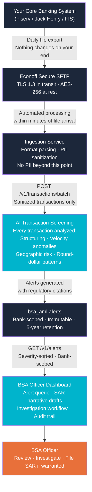
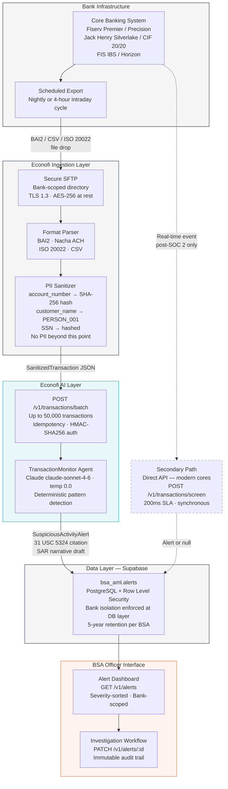

# BSA/AML Integration Flow Diagrams

Two versions for presentation use. Render with any Mermaid-compatible tool (GitHub, Notion, VS Code with Mermaid extension).

---

## Version A — "How It Works" (BSA Officer / Executive audience)

**Timeline:** File drop at 6:00 AM → batch processed → alerts in dashboard by 8:00 AM.
BSA Officer sees same-day alerts before the branch opens.

---

## Version B — Integration Architecture (Bank IT audience)

---

## Timeline Comparison

| Integration Path | File/Event → Alert Visible | Requirement |
|---|---|---|
| SFTP nightly batch | Next morning, before 8:00 AM | Default — works with all core versions |
| SFTP intraday (4-hour) | Within 4 hours of transaction | Requires bank to configure scheduled export |
| Direct API (synchronous) | < 200ms | Modern core version + SOC 2 Type II complete |

All three paths satisfy the 30-day SAR filing deadline under 31 CFR §1020.320.

---

## Supported File Formats (Primary Path)

| Format | Description | Cores |
|---|---|---|
| BAI2 | Cash management standard — deposits, withdrawals, wire activity | Fiserv, Jack Henry, FIS |
| Nacha ACH | ACH debit/credit transactions | All cores |
| ISO 20022 (XML) | Modern wire and payment standard | Newer core versions |
| Proprietary CSV | Core-specific export format | All cores — bank provides column mapping |

---

## Security Properties

| Property | Implementation |
|---|---|
| Transit encryption | TLS 1.3 minimum — SFTP and API |
| At-rest encryption | AES-256 — Supabase managed |
| PII boundary | Sanitized before API call — no PII in agent, alerts, or logs |
| Multi-tenancy | PostgreSQL Row Level Security — `SET app.current_bank_id` before every query |
| Audit trail | Append-only `api_audit_log` — no UPDATE or DELETE |
| Authentication | JWT (bank platform) · HMAC-SHA256 (ISV/direct API) |
